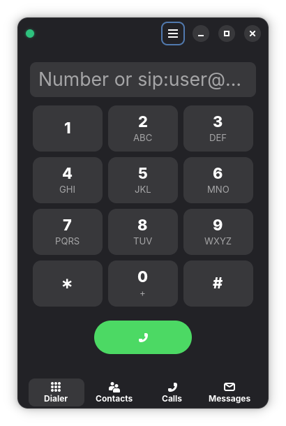

<p align="center">
  
</p>

<h1 align="center">gsipper</h1>

A modern, native GNOME SIP client built with GTK4 + libadwaita and
PJSIP's PJSUA2 Python bindings.

<p align="center">
  
</p>

## Features

**Calling**

- Outgoing calls from the dialer keypad, from a contact, or by clicking a
  row in the call history.
- Incoming-call popup window (Ringin) with answer / decline, plus a GNOME
  notification and a `sound-theme-freedesktop` ringtone.
- In-call status pane with peer, call state and live duration; one-tap
  hangup.
- E.164 dial-plan tweak: leading `+` is rewritten to `00` at dial time so
  Google-style contacts route through the trunk's international access
  prefix.

**Contacts**

- Per-contact list with search, multi-number entries (mobile / work /
  home / …) and per-number Call menu items.
- Edit and Delete from the row menu, with a confirmation dialog on
  Delete.
- Import from vCard (`.vcf`) or Google CSV.
- Click-to-call straight from a contact row.

**Call history**

- Outgoing / incoming / missed entries with a coloured direction icon
  and human-relative timestamps.
- Tap a row to drop the number back into the dialer for redial.

**Messaging (SIP IM)**

- Conversation list (newest first, unread badge on rows) and a chat view
  with incoming / outgoing bubbles, delivery status and a compose entry.
- New conversation dialog: pick a SIP URI / number and type the first
  message in one go.
- Per-contact name resolution on incoming messages — when the peer URI
  matches a stored contact, its display name is used.

**Account & registration**

- Adw.PreferencesDialog account editor (Basic + Advanced) with
  server / username / password, transport (UDP / TCP / TLS), STUN, codec
  priority list and a few NAT / keep-alive knobs.
- Codecs shipped pre-compiled in the .deb: **Opus**, **G.722**,
  **G.722.1**, **G.711** a-law / µ-law, and **GSM Full-Rate**.
  Each is selectable and reorderable in Account → Advanced → Codecs.
- Status dot in the window header bar — green online, yellow connecting,
  red offline; clickable for Connect / Disconnect / Reconnect / Exit;
  tooltip carries the SIP reason text.

**Call recording**

- Per-call toggle in Window → Settings → "Record calls". When on, every
  connected call is recorded to WAV via PJSUA2's `AudioMediaRecorder`
  (mixed mic + remote), then converted to MP3 with `ffmpeg` on hangup.
- Recordings live in `~/.local/share/gsipper/recordings/` as
  `YYYYMMDD-HHMMSS_<peer>.mp3`.
- Rows in the Recent tab with a saved recording show a ▶ button. Clicking
  it opens a modal player (GStreamer `playbin`) with a draggable
  timeline and play / pause / stop transport buttons.

**Settings & autostart**

- Window → Settings dialog exposes:
  - **Start minimized** — launch hidden in the tray; SIP still
    registers, the dot turns green, ringtone + incoming popup still
    fire. Re-launching from the app grid or clicking the tray icon
    restores the window.
  - **Run on start** — writes / removes
    `~/.config/autostart/com.pulpoff.gsipper.desktop` so the app
    auto-launches on login. Combine with "Start minimized" for the
    classic always-on-tray setup.
  - **Record calls** — see above; disabled with an inline hint when
    `ffmpeg` is missing from `PATH`.
  - **Enable messages** — show or hide the Messages tab from the view
    switcher. Off by default; toggling is live — no restart needed.
    Stored conversations are kept either way.

**Desktop integration**

- App-grid entry, `tel:` / `sip:` / `sips:` URI handler, hicolor icon.
- Window X button hides to the tray; SIP keeps running so incoming
  calls still ring. Real quit goes through the in-window menu or
  Ctrl+Q.
- AyatanaAppIndicator tray icon (when available) mirroring the status
  dot.
- GNOME Shell status-bar extension (`gsipper@pulpoff.com`) for shells
  45-49 — single click brings the gsipper window forward via D-Bus.
- All PJSIP calls run on a dedicated worker thread so the GTK main loop
  never blocks on registration, INVITE/BYE, or `MESSAGE`.

## Run from source

```sh
./build.sh
```

On first run, `build.sh` will `apt install` any missing system packages
and then launch the app. PJSUA2 is **not** packaged on Debian/Ubuntu,
so the script will also compile pjproject and its SWIG bindings from
source into `~/.cache/gsipper` (one-time, ~5 min, ~150 MB).

Other `build.sh` modes:

```sh
./build.sh --deps     # install runtime + build dependencies, don't launch
./build.sh --pjsua2   # only (re)build pjsua2
./build.sh --run      # launch without re-checking dependencies
./build.sh --deb      # build dist/gsipper_<version>_<arch>.deb
```

Once dependencies are installed, the app can also be launched directly:

```sh
python3 -m gsipper
```

## Debian package

```sh
./build.sh --deb
sudo apt install ./dist/gsipper_1.3.7_amd64.deb
sudo gsipper --install-pjsua2     # compile PJSUA2 bindings (one-time)
```

The package installs:

| Path | What |
|------|------|
| `/usr/bin/gsipper` | Launcher (also handles `--install-pjsua2`) |
| `/usr/lib/gsipper/gsipper/` | Python module |
| `/usr/share/applications/com.pulpoff.gsipper.desktop` | App-grid entry + `sip:` / `tel:` URI handler |
| `/usr/share/icons/hicolor/scalable/apps/gsipper.svg` | App icon |
| `/usr/share/gnome-shell/extensions/gsipper@pulpoff.com/` | Status-bar extension |

After install, enable the status-bar extension once:

```sh
gnome-extensions enable gsipper@pulpoff.com
# X11: Alt+F2, type 'r', Enter   |   Wayland: log out and back in
```

### Cross-building for arm64

Run the cross-build wrapper from an amd64 host. It spins up an
Ubuntu 24.04 container under `--platform=linux/arm64`, installs the
build deps, and runs the normal `./build.sh --pjsua2 && ./build.sh
--deb` inside — Docker's qemu-user-static integration transparently
emulates the arm64 ISA, so the bundled `_pjsua2.so` in the resulting
deb is native to arm64.

```sh
# One-time host setup:
sudo apt install docker.io qemu-user-static binfmt-support
sudo systemctl enable --now docker
sudo docker run --rm --privileged multiarch/qemu-user-static --reset -p yes

# Then per-arch:
./packaging/build-cross.sh arm64    # → dist/gsipper_<version>_arm64.deb
./packaging/build-cross.sh amd64    # same as the plain --deb path
```

The build takes ~10–15 minutes under qemu emulation (pjproject's
`make` is the bulk of it). The output lands in the host's `dist/`
directory and is byte-identical to one you'd build natively on
arm64 hardware.

---

<p align="center">
  by <a href="https://callagent.pro">callagent.pro</a>
</p>
